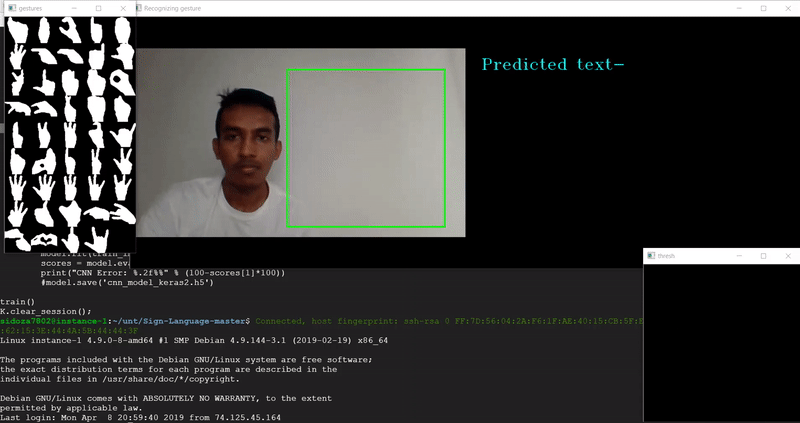
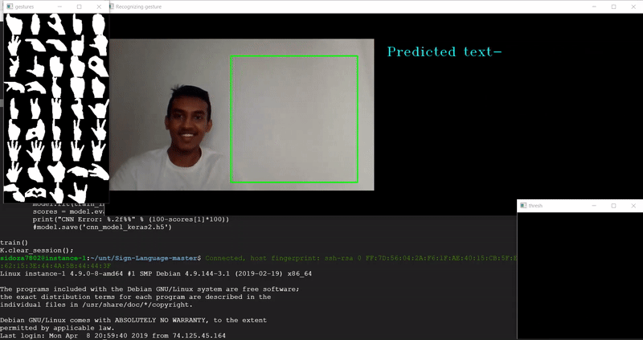
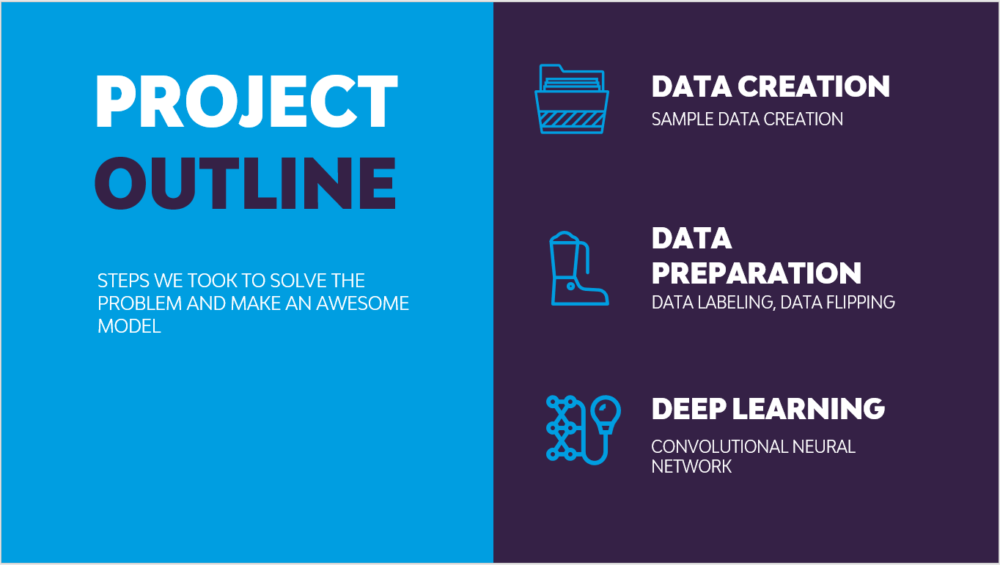
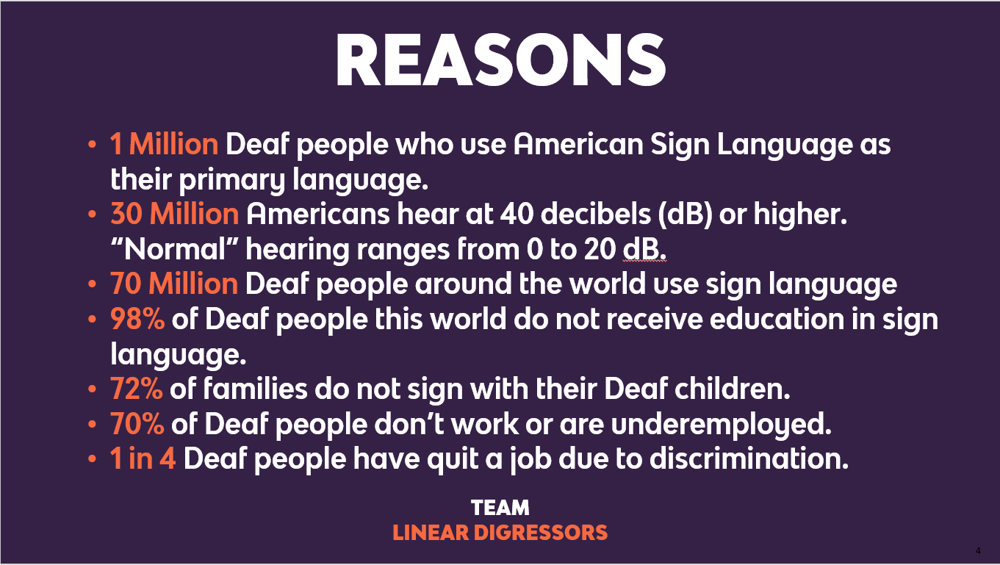

[](https://choosealicense.com/licenses/mit)
[](http://hits.dwyl.io/harshbg/Sign-Language-Interpreter-using-Deep-Learning)


# Sign Language Interpreter using Deep Learning
> A sign language interpreter using live video feed from the camera. 
The project was completed in 24 hours as part of HackUNT-19, the University of North Texas's annual Hackathon. You can view the project demo on [YouTube](https://link.harshgupta.com/acd72). 

## Table of contents
* [General info](#general-info)
* [Screenshots](#screenshots)
* [Demo](#demo)
* [Technologies and Tools](#technologies-and-tools)
* [Setup](#setup)
* [Process](#process)
* [Code Examples](#code-examples)
* [Features](#features)
* [Status](#status)
* [Contact](#contact)

## General info

The theme at HACK UNT 19 was to use technology to improve accessibility by finding a creative solution to benefit the lives of those with a disability. 
We wanted to make it easy for 70 million deaf people across the world to be independent of translators for there daily communication needs, so we designed the app to work as a personal translator 24*7 for the deaf people.

## Demo








**The entire demo of the project can be found on [YouTube](https://link.harshgupta.com/acd72).**


## Screenshots




## Technologies and Tools
* Python 
* TensorFlow
* Keras
* OpenCV

## Setup

* Use comand promt to setup environment by using install_packages.txt and install_packages_gpu.txt files. 
 
`pyton -m pip r install_packages.txt`

This will help you in installing all the libraries required for the project.

## Process

* Run `set_hand_histogram.py` to set the hand histogram for creating gestures. 
* Once you get a good histogram, save it in the code folder, or you can use the histogram created by us that can be found [here](https://github.com/harshbg/Sign-Language-Interpreter-using-Deep-Learning/blob/master/Code/hist).
* Added gestures and label them using OpenCV which uses webcam feed. by running `create_gestures.py` and stores them in a database. Alternately, you can use the gestures created by us [here](https://github.com/harshbg/Sign-Language-Interpreter-using-Deep-Learning/tree/master/Code).
* Add different variations to the captured gestures by flipping all the images by using `Rotate_images.py`.
* Run `load_images.py` to split all the captured gestures into training, validation and test set. 
* To view all the gestures, run `display_gestures.py` .
* Train the model using Keras by running `cnn_model_train.py`.
* Run `final.py`. This will open up the gesture recognition window which will use your webcam to interpret the trained American Sign Language gestures.  

## Code Examples

````
# Model Traiining using CNN

import numpy as np
import pickle
import cv2, os
from glob import glob
from keras import optimizers
from keras.models import Sequential
from keras.layers import Dense
from keras.layers import Dropout
from keras.layers import Flatten
from keras.layers.convolutional import Conv2D
from keras.layers.convolutional import MaxPooling2D
from keras.utils import np_utils
from keras.callbacks import ModelCheckpoint
from keras import backend as K
K.set_image_dim_ordering('tf')

os.environ['TF_CPP_MIN_LOG_LEVEL'] = '3'

def get_image_size():
	img = cv2.imread('gestures/1/100.jpg', 0)
	return img.shape

def get_num_of_classes():
	return len(glob('gestures/*'))

image_x, image_y = get_image_size()

def cnn_model():
	num_of_classes = get_num_of_classes()
	model = Sequential()
	model.add(Conv2D(16, (2,2), input_shape=(image_x, image_y, 1), activation='relu'))
	model.add(MaxPooling2D(pool_size=(2, 2), strides=(2, 2), padding='same'))
	model.add(Conv2D(32, (3,3), activation='relu'))
	model.add(MaxPooling2D(pool_size=(3, 3), strides=(3, 3), padding='same'))
	model.add(Conv2D(64, (5,5), activation='relu'))
	model.add(MaxPooling2D(pool_size=(5, 5), strides=(5, 5), padding='same'))
	model.add(Flatten())
	model.add(Dense(128, activation='relu'))
	model.add(Dropout(0.2))
	model.add(Dense(num_of_classes, activation='softmax'))
	sgd = optimizers.SGD(lr=1e-2)
	model.compile(loss='categorical_crossentropy', optimizer=sgd, metrics=['accuracy'])
	filepath="cnn_model_keras2.h5"
	checkpoint1 = ModelCheckpoint(filepath, monitor='val_acc', verbose=1, save_best_only=True, mode='max')
	callbacks_list = [checkpoint1]
	#from keras.utils import plot_model
	#plot_model(model, to_file='model.png', show_shapes=True)
	return model, callbacks_list

def train():
	with open("train_images", "rb") as f:
		train_images = np.array(pickle.load(f))
	with open("train_labels", "rb") as f:
		train_labels = np.array(pickle.load(f), dtype=np.int32)

	with open("val_images", "rb") as f:
		val_images = np.array(pickle.load(f))
	with open("val_labels", "rb") as f:
		val_labels = np.array(pickle.load(f), dtype=np.int32)

	train_images = np.reshape(train_images, (train_images.shape[0], image_x, image_y, 1))
	val_images = np.reshape(val_images, (val_images.shape[0], image_x, image_y, 1))
	train_labels = np_utils.to_categorical(train_labels)
	val_labels = np_utils.to_categorical(val_labels)

	print(val_labels.shape)

	model, callbacks_list = cnn_model()
	model.summary()
	model.fit(train_images, train_labels, validation_data=(val_images, val_labels), epochs=15, batch_size=500, callbacks=callbacks_list)
	scores = model.evaluate(val_images, val_labels, verbose=0)
	print("CNN Error: %.2f%%" % (100-scores[1]*100))
	#model.save('cnn_model_keras2.h5')

train()
K.clear_session();

````

## Features
Our model was able to predict the 44 characters in the ASL with a prediction accuracy >95%.

Features that can be added:
* Deploy the project on cloud and create an API for using it.
* Increase the vocabulary of our model
* Incorporate feedback mechanism to make the model more robust
* Add more sign languages

## Status
Project is: _finished_. Our team was the winner of the UNT Hackaton 2019. You can find the our final submission post on [devpost](https://rebrand.ly/754c5). If you would like us to implement the project end-to-end for you please book a [session](https://link.harshgupta.com/5e580). 

## Contact
Created by me with my teammates [Siddharth Oza](https://github.com/siddharthoza), [Ashish Sharma](https://github.com/ashish1993utd), and [Manish Shukla](https://github.com/Manishms18).

If you loved what you read here and feel like we can collaborate to produce some exciting stuff, or if you
just want to shoot a question, please feel free to connect with me on <a href="hello@harshgupta.com" target="_blank">email</a>, 
<a href="https://link.harshgupta.com/c9a5b" target="_blank">LinkedIn</a>, or 
<a href="https://link.harshgupta.com/34c63" target="_blank">Twitter</a>. 
My other projects can be found [here](https://link.harshgupta.com/85f2e).

[](https://link.harshgupta.com/e144a)
[](https://link.harshgupta.com/34c63)

